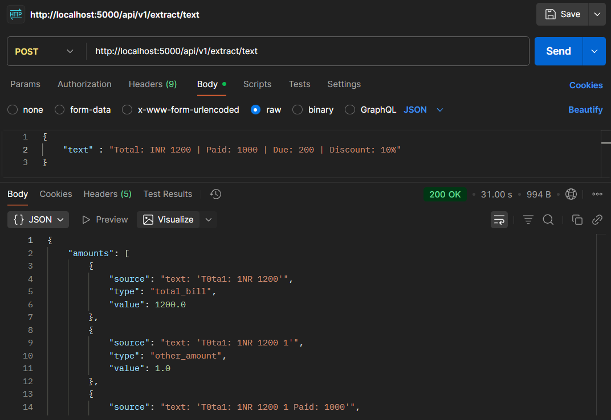
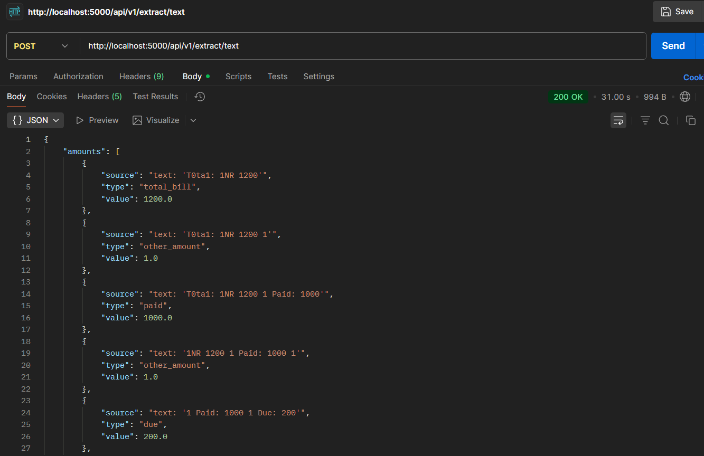
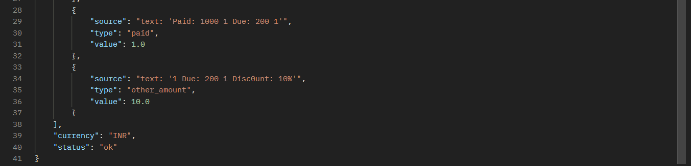

# Amount Extractor Backend

A robust Flask-based REST API service that extracts and classifies financial amounts from medical bills, receipts, and other documents. The service supports both text input and image input (via OCR), with intelligent context-aware classification using Google Gemini AI.

## Example Run (Screenshots)
post http://localhost:5000/api/v1/extract/text
### Input (Medical Bill Screenshot)
Here is an example input image given to the service:  



---

### Output (Structured JSON Response 1)
When processed, the extracted amounts with context look like this:  





---

## 📋 Table of Contents

- [Problem Statement](#problem-statement)
- [Features](#features)
- [Architecture](#architecture)
- [Installation](#installation)
- [Running the Application](#running-the-application)
- [API Documentation](#api-documentation)
- [Examples](#examples)
- [Error Handling](#error-handling)
- [Troubleshooting](#troubleshooting)
- [Project Structure](#project-structure)

---

## Problem Statement

Design a backend service that extracts financial amounts from medical bills or receipts (typed or scanned, possibly crumpled or partially visible). The service must handle:

- ✅ OCR extraction from scanned documents/images
- ✅ OCR error corrections & digit cleanup
- ✅ Context classification (e.g., `total_bill`, `amount_due`, `paid`, `discount`)
- ✅ Return structured JSON output with provenance (source line, context)

---

## Features

- **REST API** built with Flask
- **Dual Input Support**: Text input and image input (via OCR)
- **Tesseract OCR** integration for image-to-text conversion
- **AI-Powered Classification**: Context-aware amount classification using Google Gemini AI
- **Robust Error Handling**: Comprehensive error handlers for 404, 405, 500, and general exceptions
- **Windows Optimized**: Fully tested and optimized for Windows environments
- **Input Validation**: Validates text and image inputs before processing
- **Structured JSON Responses**: Consistent JSON format for all responses
- **Provenance Tracking**: Tracks source context for each extracted amount

---

## Architecture

The system is designed as a modular pipeline with the following components:

### Input Layer
- Accepts either raw text (already extracted) or image files (scanned/photographed medical bills, receipts)
- For images, OCR (pytesseract) extracts raw text
- Supports multiple image formats: PNG, JPG, JPEG, GIF, BMP, TIFF, WEBP

### Preprocessing Layer
- Cleans extracted text by removing noise
- Fixes common OCR errors (e.g., `1O → 10`, `l → 1`, `| → 1`)
- Tokenizes text into meaningful units (words + numbers)

### Context Classification Layer
- Uses regex rules for detecting numeric patterns
- Google Gemini AI analyzes surrounding context to classify financial amounts
- Classification categories: `total_bill`, `paid`, `due`, `discount`, `other_amount`

### Provenance Tracking
- Stores where the extracted amount came from (raw text snippet)
- Ensures traceability for debugging and audit

### Output Layer
- Produces structured JSON response with currency, amounts, and status

---

## Installation

### Prerequisites

- **Python 3.10+** (Python 3.12 recommended)
- **Tesseract OCR** (v5+ recommended)

### Step 1: Install Python Dependencies

```bash
pip install -r requirements.txt
```

**Note**: The `requirements.txt` includes basic dependencies. The application also requires `google-generativeai` which should be installed separately:

```bash
pip install google-generativeai
```

### Step 2: Install Tesseract OCR

#### Windows
1. Download Tesseract OCR from [GitHub Releases](https://github.com/UB-Mannheim/tesseract/wiki)
2. Run the installer
3. Add Tesseract to your system PATH, or uncomment and set the path in `ocr_pipeline.py`:
   ```python
   pytesseract.pytesseract.tesseract_cmd = r'C:\Program Files\Tesseract-OCR\tesseract.exe'
   ```

#### Linux (Ubuntu/Debian)
```bash
sudo apt update
sudo apt install tesseract-ocr
```

#### macOS (Homebrew)
```bash
brew install tesseract
```

### Step 3: Configure Google Gemini API (Optional)

The application uses Google Gemini AI for context classification. The API key is currently hardcoded in `ocr_pipeline.py`. For production use, consider:

1. Creating a `.env` file:
   ```
   GEMINI_API_KEY=your_api_key_here
   ```
2. Updating `ocr_pipeline.py` to load from environment variables

---

## Running the Application

### Method 1: Direct Python Execution

```bash
python app.py
```

### Method 2: Using Batch File (Windows)

Double-click `run.bat` or run:
```bash
run.bat
```

### Method 3: Using PowerShell Script (Windows)

```powershell
.\run.ps1
```

### Server Output

When the server starts successfully, you'll see:

```
==================================================
Amount Extractor Backend Server
==================================================
Server starting on http://localhost:5000
Health check: http://localhost:5000/health
==================================================
```

The API will be available at: **http://localhost:5000**

---

## API Documentation

### Base URL
```
http://localhost:5000
```

### Endpoints

#### 1. Root Endpoint

**GET** `/`

Returns API information and available endpoints.

**Response:**
```json
{
  "message": "Amount Extractor API",
  "service": "amount-extractor",
  "version": "1.0",
  "endpoints": {
    "health": "/health",
    "extract_text": "/api/v1/extract/text (POST)",
    "extract_image": "/api/v1/extract/image (POST)"
  }
}
```

#### 2. Health Check

**GET** `/health`

Check if the service is running.

**Response:**
```json
{
  "status": "ok",
  "service": "amount-extractor",
  "version": "1.0"
}
```

#### 3. Extract Amounts from Text

**POST** `/api/v1/extract/text`

Extract and classify financial amounts from text input.

**Request Headers:**
```
Content-Type: application/json
```

**Request Body:**
```json
{
  "text": "Total bill amount: ₹1500.00, Paid: ₹1000.00, Due: ₹500.00"
}
```

**Success Response (200):**
```json
{
  "currency": "INR",
  "amounts": [
    {
      "type": "total_bill",
      "value": 1500.0,
      "source": "text: 'Total bill amount: ₹1500.00'"
    },
    {
      "type": "paid",
      "value": 1000.0,
      "source": "text: 'Paid: ₹1000.00'"
    },
    {
      "type": "due",
      "value": 500.0,
      "source": "text: 'Due: ₹500.00'"
    }
  ],
  "status": "ok"
}
```

**Error Responses:**

- **400 Bad Request**: No text provided or invalid input
  ```json
  {
    "status": "error",
    "reason": "No text provided"
  }
  ```

- **500 Internal Server Error**: Processing error
  ```json
  {
    "status": "error",
    "reason": "Internal server error: <error message>"
  }
  ```

#### 4. Extract Amounts from Image

**POST** `/api/v1/extract/image`

Extract and classify financial amounts from an image file using OCR.

**Request:**
- Content-Type: `multipart/form-data`
- Form field: `file` (image file)

**Supported Image Formats:**
- PNG, JPG, JPEG, GIF, BMP, TIFF, WEBP

**Success Response (200):**
```json
{
  "currency": "INR",
  "amounts": [
    {
      "type": "total_bill",
      "value": 2500.0,
      "source": "text: 'Total Amount: 2500.00'"
    }
  ],
  "status": "ok"
}
```

**Error Responses:**

- **400 Bad Request**: No file provided or invalid file type
  ```json
  {
    "status": "error",
    "reason": "No file provided"
  }
  ```

- **500 Internal Server Error**: OCR or processing error
  ```json
  {
    "status": "error",
    "reason": "OCR failed: <error message>"
  }
  ```

---

## Examples

### Using cURL

#### Health Check
```bash
curl http://localhost:5000/health
```

#### Extract from Text
```bash
curl -X POST http://localhost:5000/api/v1/extract/text \
  -H "Content-Type: application/json" \
  -d "{\"text\": \"Total: ₹1500.00, Paid: ₹1000.00\"}"
```

#### Extract from Image
```bash
curl -X POST http://localhost:5000/api/v1/extract/image \
  -F "file=@receipt.png"
```

### Using PowerShell

#### Health Check
```powershell
Invoke-WebRequest -Uri http://localhost:5000/health -UseBasicParsing
```

#### Extract from Text
```powershell
$body = @{text="Total: ₹1500.00, Paid: ₹1000.00"} | ConvertTo-Json
Invoke-WebRequest -Uri http://localhost:5000/api/v1/extract/text `
  -Method POST -Body $body -ContentType "application/json" -UseBasicParsing
```

### Using Python Requests

```python
import requests

# Health check
response = requests.get('http://localhost:5000/health')
print(response.json())

# Extract from text
data = {"text": "Total bill: ₹1500.00, Paid: ₹1000.00, Due: ₹500.00"}
response = requests.post('http://localhost:5000/api/v1/extract/text', json=data)
print(response.json())

# Extract from image
with open('receipt.png', 'rb') as f:
    files = {'file': f}
    response = requests.post('http://localhost:5000/api/v1/extract/image', files=files)
    print(response.json())
```

### Using Postman

1. **Health Check**: Create a GET request to `http://localhost:5000/health`

2. **Extract from Text**: 
   - Method: POST
   - URL: `http://localhost:5000/api/v1/extract/text`
   - Headers: `Content-Type: application/json`
   - Body (raw JSON):
     ```json
     {
       "text": "Total: ₹1500.00, Paid: ₹1000.00"
     }
     ```

3. **Extract from Image**:
   - Method: POST
   - URL: `http://localhost:5000/api/v1/extract/image`
   - Body (form-data):
     - Key: `file` (type: File)
     - Value: Select your image file

---

## Error Handling

The application includes comprehensive error handling:

### HTTP Status Codes

- **200 OK**: Successful request
- **400 Bad Request**: Invalid input (missing text/file, invalid file type)
- **404 Not Found**: Endpoint not found
- **405 Method Not Allowed**: HTTP method not allowed for endpoint
- **500 Internal Server Error**: Server-side processing error

### Error Response Format

All errors return JSON in the following format:

```json
{
  "status": "error",
  "reason": "Error description",
  "message": "Additional error message (if applicable)"
}
```

### Special Error Cases

- **No amounts found**: Returns `status: "no_amounts_found"` with reason
- **OCR failure**: Returns `status: "error"` with OCR-specific error message
- **Tesseract not found**: Returns clear error message if Tesseract OCR is not installed

---

## Troubleshooting

### Common Issues

#### 1. "Tesseract OCR not found" Error

**Solution:**
- Ensure Tesseract OCR is installed
- Add Tesseract to your system PATH, or set the path in `ocr_pipeline.py`:
  ```python
  pytesseract.pytesseract.tesseract_cmd = r'C:\Program Files\Tesseract-OCR\tesseract.exe'
  ```

#### 2. Port 5000 Already in Use

**Solution:**
- Change the port in `app.py`:
  ```python
  app.run(host='127.0.0.1', port=5001, debug=True, use_reloader=False)
  ```

#### 3. "No module named 'google.generativeai'" Error

**Solution:**
```bash
pip install google-generativeai
```

#### 4. 404 Errors on Root Endpoint

**Solution:**
- Ensure you're using the latest version of `app.py` which includes the root route handler
- Check that the server is running: `http://localhost:5000/health`

#### 5. Image Processing Fails

**Solution:**
- Verify the image file is not corrupted
- Check that the file format is supported (PNG, JPG, JPEG, GIF, BMP, TIFF, WEBP)
- Ensure the image contains readable text

### Debug Mode

The application runs in debug mode by default. To disable debug mode for production:

```python
app.run(host='127.0.0.1', port=5000, debug=False, use_reloader=False)
```

---

## Project Structure

```
amount-extractor-backend/
│
├── app.py                 # Main Flask application
├── ocr_pipeline.py        # OCR and text processing pipeline
├── requirements.txt       # Python dependencies
├── readme.md             # This file
├── run.bat               # Windows batch file to run the app
├── run.ps1               # PowerShell script to run the app
│
└── images/               # Example images
    ├── input.png         # Sample input image
    ├── output_1.png      # Sample output 1
    └── output_2.png      # Sample output 2
```

---

## Dependencies

### Core Dependencies
- **Flask** (>=2.0): Web framework
- **pytesseract**: Python wrapper for Tesseract OCR
- **Pillow**: Image processing library
- **google-generativeai**: Google Gemini AI integration
- **rapidfuzz**: Fuzzy string matching (for future enhancements)
- **python-dotenv**: Environment variable management

### System Dependencies
- **Tesseract OCR**: OCR engine (must be installed separately)

---

## License

This project is provided as-is for educational and development purposes.

---

## Contributing

Contributions are welcome! Please feel free to submit a Pull Request.

---

## Support

For issues, questions, or contributions, please open an issue on the repository.

---

**Made with ❤️ for extracting financial amounts from documents**
